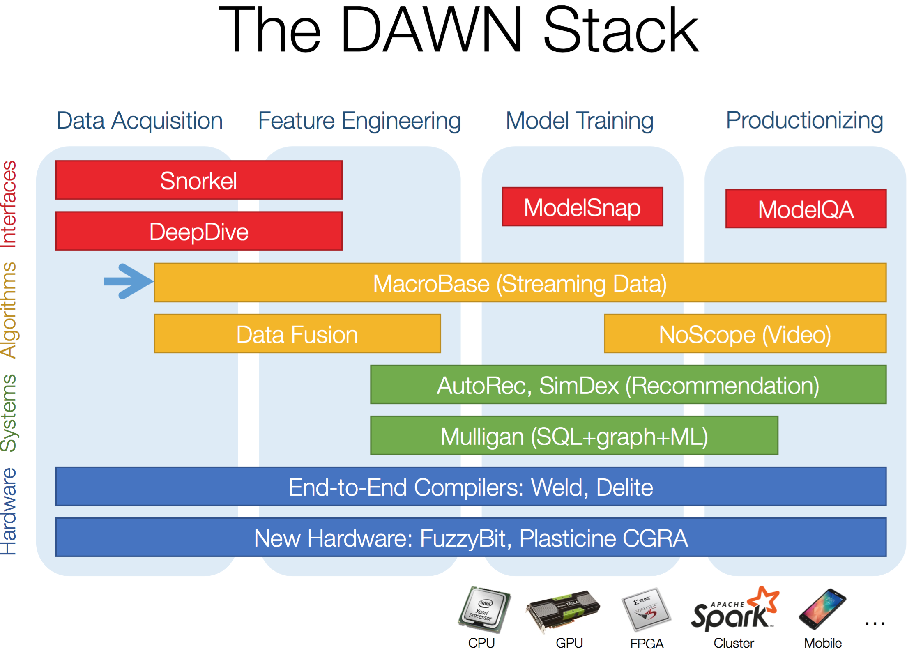

# dawn

Docker Images stack for [Stanford DAWN](http://dawn.cs.stanford.edu/) project

- Macrobase sandbox created

## [Macrobase](https://github.com/stanford-futuredata/macrobase/) 

### What is Macrobase

MacroBase is a new analytic monitoring engine designed to prioritize human attention 
in large-scale datasets and data streams. 
Unlike a traditional analytics engine, 
MacroBase is specialized for one task: finding and explaining unusual or interesting trends in data.

Under the hood, MacroBase is architected for rapid adaptation to new application domains. 
MacroBase has been successfully used for analyses in domains 
including datacenter and mobile application monitoring, industrial manufacturing, 
and video and satellite image analysis.

MacroBase supports streaming operation, meaning that once users identify an important behavior, 
they can track it continuously over time.

[Peter Bailis: MacroBase, Prioritizing Attention in Fast Data Streams | Talks at Google](https://youtu.be/XhTJEU_l8rw)

### Using Macrobase sandbox

Setup the sandbox with following compose-compose command.

    docker-compose -f docker-compose-microbase.yml up
    
    
Then just open [http://localhost:8080](http://localhost:8080) to use macrobase

Type in `Based Query` with following SQL statement and start play. 

    select * from sensor_data_demo;
    
    
## [snorkel](https://hazyresearch.github.io/snorkel/)

### What is Snorkel

Snorkel is a system for rapidly creating, modeling, and managing training data, 
currently focused on accelerating the development of structured 
or “dark” data extraction applications for domains in 
which large labeled training sets are not available or easy to obtain.